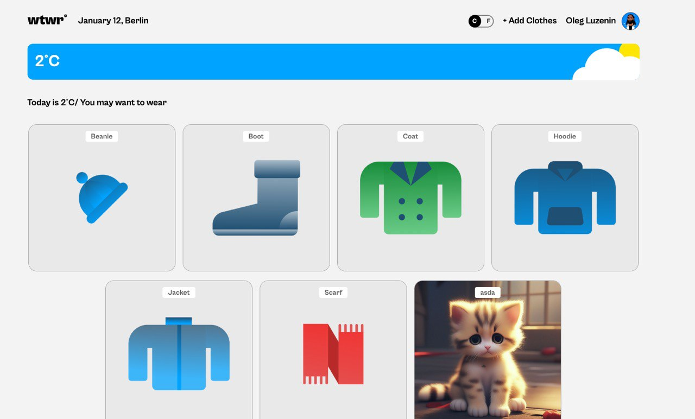
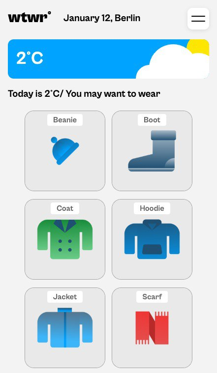

# 🌤️ WTWR - What to Wear

## Full-Stack React Web Application

**WTWR (What to Wear)** is a full-stack web application that provides intelligent clothing recommendations based on real-time weather conditions. Built with React on the frontend and Express.js on the backend, this application demonstrates modern web development practices including user authentication, RESTful API design, and responsive UI/UX.

🌐 **Live Demo:** [https://se-project-react-two.vercel.app](https://se-project-react-two.vercel.app)

---

## 📋 Table of Contents

- [Overview](#overview)
- [Architecture](#architecture)
- [Features](#features)
- [Technologies Stack](#technologies-stack)
- [Screenshots](#screenshots)
- [Getting Started](#getting-started)
- [Project Structure](#project-structure)
- [API Integration](#api-integration)
- [Deployment](#deployment)
- [Author](#author)

---

## 🎯 Overview

WTWR solves the daily challenge of choosing appropriate clothing for current weather conditions. Users can create accounts, build their virtual wardrobe, and receive personalized clothing recommendations based on real-time weather data from the OpenWeather API.

### Key Highlights

- **Full-Stack Architecture**: React frontend communicating with Express.js backend via RESTful API
- **Real-time Weather Integration**: Fetches live weather data from OpenWeather API
- **User Authentication**: Secure JWT-based authentication system
- **Responsive Design**: Optimized for desktop, tablet, and mobile devices
- **Modern React Patterns**: Utilizes hooks, context API, and lazy loading

---

## 🏗️ Architecture

This application follows a client-server architecture:

### Frontend (This Repository)

- **Framework**: React 19.0.0
- **Build Tool**: Vite
- **Routing**: React Router v6
- **State Management**: React Context API
- **Styling**: CSS with BEM methodology

### Backend

- **Repository**: [se_project_express](https://github.com/oleg-lzn/se_project_express)
- **Framework**: Express.js
- **Database**: MongoDB
- **Authentication**: JWT (JSON Web Tokens)
- **API**: RESTful architecture

### External APIs

- **OpenWeather API**: Real-time weather data

---

## ✨ Features

### 🔐 User Authentication

- Secure user registration and login
- JWT-based session management
- Protected routes for authenticated users
- Persistent login sessions

### 👤 User Profile Management

- Customizable user profiles
- Avatar support
- Edit profile information (name, avatar URL)
- View personal clothing collection

### 👔 Wardrobe Management

- Add new clothing items with images
- Delete unwanted items
- Categorize by weather type (hot, warm, cold)
- Image URL validation

### ❤️ Social Features

- Like/unlike clothing items
- View liked items in profile
- Track item popularity

### 🌦️ Weather-Based Recommendations

- Real-time weather data for configured location
- Dynamic clothing recommendations based on temperature
- Weather condition visualization (sunny, cloudy, rainy, snowy, stormy, foggy)
- Day/night detection with appropriate imagery

### 🌡️ Temperature Units

- Toggle between Fahrenheit and Celsius
- Persistent unit preference
- Real-time conversion

### 📱 Responsive Design

- Mobile-first approach
- Optimized layouts for all screen sizes
- Touch-friendly interface
- Hamburger menu for mobile navigation

---

## 💻 Technologies Stack

### Frontend

| Technology           | Purpose                                        | Version  |
| -------------------- | ---------------------------------------------- | -------- |
| **React**            | UI library for building interactive interfaces | 19.0.0   |
| **Vite**             | Fast build tool and development server         | 5.4.10   |
| **React Router DOM** | Client-side routing and navigation             | 6.28.0   |
| **Validator**        | Input validation library                       | 13.15.15 |
| **ESLint**           | Code quality and consistency                   | 9.13.0   |

### Backend (Separate Repository)

| Technology       | Purpose                             |
| ---------------- | ----------------------------------- |
| **Express.js**   | Node.js web application framework   |
| **MongoDB**      | NoSQL database for data persistence |
| **Mongoose**     | MongoDB object modeling             |
| **bcryptjs**     | Password hashing                    |
| **jsonwebtoken** | JWT authentication                  |
| **validator**    | Server-side validation              |
| **cors**         | Cross-origin resource sharing       |

### External APIs

- **OpenWeather API**: Weather data provider

### Development Tools

- **Git & GitHub**: Version control and collaboration
- **Figma**: UI/UX design and prototyping
- **BEM Methodology**: CSS naming convention
- **Custom Hooks**: useFormAndValidation for form handling

---

## 📸 Screenshots

### Desktop View



### Mobile View



---

## 🚀 Getting Started

### Prerequisites

- Node.js (v14 or higher)
- npm or yarn
- OpenWeather API key (free tier available)

### Installation

1. **Clone the repository**

   ```bash
   git clone git@github.com:oleg-lzn/se_project_react.git
   cd se_project_react
   ```

2. **Install dependencies**

   ```bash
   npm install
   ```

3. **Configure environment**

   Update the constants in `src/utils/constants.js`:

   ```javascript
   export const APIKey = "your_openweather_api_key";
   export const latitude = 52.5244; // Your location
   export const longitude = 13.4105; // Your location
   ```

4. **Set up the backend**

   Clone and set up the backend repository:

   ```bash
   git clone git@github.com:oleg-lzn/se_project_express.git
   cd se_project_express
   npm install
   npm start
   ```

   The backend will run on `http://localhost:3001`

5. **Start the development server**

   ```bash
   npm run dev
   ```

   The application will open at `http://localhost:5173`

### Available Scripts

- `npm run dev` - Start development server with hot reload
- `npm run build` - Build for production
- `npm run preview` - Preview production build locally
- `npm run lint` - Run ESLint for code quality checks
- `npm run deploy` - Deploy to production server

---

## 📁 Project Structure

```
se_project_react/
├── public/                    # Static assets
│   ├── desktop.jpg           # Desktop screenshot
│   ├── mobile.jpg            # Mobile screenshot
│   └── Favicon.svg           # Favicon
│
├── src/
│   ├── assets/               # Images, fonts, and static files
│   │   ├── fonts/           # Custom fonts (Cabinet Grotesk)
│   │   └── images/          # SVG icons and weather condition images
│   │
│   ├── components/
│   │   ├── App/             # Main app component and subcomponents
│   │   │   ├── Header/      # Navigation header with toggle switch
│   │   │   ├── Main/        # Main page with weather card
│   │   │   │   ├── ItemCard/        # Clothing item cards
│   │   │   │   ├── WeatherCard/     # Weather display
│   │   │   │   └── Profile/         # User profile page
│   │   │   ├── Footer/      # Application footer
│   │   │   ├── Modal/       # Base modal component
│   │   │   ├── ModalWithForm/       # Form modal wrapper
│   │   │   ├── AddItemModal/        # Add new clothing item
│   │   │   ├── EditProfileModal/    # Edit user profile
│   │   │   ├── LoginModal/          # User login
│   │   │   ├── RegisterModal/       # User registration
│   │   │   ├── ItemModal/           # View clothing item details
│   │   │   ├── ConfirmationModal/   # Delete confirmation
│   │   │   ├── ProtectedRoute/      # Route authentication guard
│   │   │   └── PageNotFound/        # 404 error page
│   │   ├── App.jsx          # Root application component
│   │   └── App.css          # Application styles
│   │
│   ├── contexts/             # React Context providers
│   │   ├── CurrentTemperatureUnitContext.js
│   │   └── CurrentUserContext.js
│   │
│   ├── hooks/                # Custom React hooks
│   │   └── useFormAndValidation.js
│   │
│   ├── utils/                # Utility functions and API clients
│   │   ├── api.js           # Backend API methods
│   │   ├── auth.js          # Authentication methods
│   │   ├── weatherAPI.js    # OpenWeather API integration
│   │   ├── token.js         # JWT token management
│   │   ├── constants.js     # Configuration constants
│   │   └── weather_conditions.js
│   │
│   ├── vendor/               # Third-party CSS
│   │   ├── fonts.css        # Font declarations
│   │   └── normalize.css    # CSS reset
│   │
│   ├── index.css            # Global styles
│   └── main.jsx             # Application entry point
│
├── index.html               # HTML template
├── vite.config.js          # Vite configuration
├── eslint.config.js        # ESLint configuration
├── package.json            # Dependencies and scripts
└── README.md               # This file
```

---

## 🔌 API Integration

### Backend API Endpoints

#### Authentication

- `POST /signup` - Register new user
- `POST /signin` - User login (returns JWT)
- `GET /users/me` - Get current user data
- `PATCH /users/me` - Update user profile

#### Clothing Items

- `GET /items` - Get all clothing items
- `POST /items` - Create new clothing item
- `DELETE /items/:id` - Delete clothing item
- `PUT /items/:id/likes` - Like an item
- `DELETE /items/:id/likes` - Unlike an item

### External APIs

#### OpenWeather API

- **Endpoint**: `https://api.openweathermap.org/data/2.5/weather`
- **Data Retrieved**: Temperature, weather conditions, sunrise/sunset times
- **Update Frequency**: Real-time on page load and temperature unit change

---

## 🚢 Deployment

### Production Environment

The application is deployed to:

- **Frontend**: https://se-project-react-two.vercel.app (deployed on Vercel)
- **Backend API**: Deployed on Render.com

### Deployment Configuration

### Build and Deploy

```bash
npm run build    # Creates optimized production build in /dist
npm run deploy   # Builds and deploys to production server
```

---

## 🎨 Design Principles

### BEM Methodology

All CSS classes follow Block-Element-Modifier naming convention for maintainability and clarity.

### Component-Based Architecture

Reusable, modular components for easier maintenance and testing.

### Performance Optimization

- Code splitting with React.lazy()
- Optimized images
- Minimal re-renders with proper state management
- Fast build times with Vite

### User Experience

- Intuitive navigation
- Loading states for async operations
- Error handling and user feedback
- Smooth animations and transitions
- Accessible design patterns

---

## 🔐 Security Features

- JWT token-based authentication
- Protected routes for authenticated users
- Secure password handling (hashed on backend)
- Token stored in localStorage
- Authorization headers for API requests
- Input validation on both client and server

---

## 🧪 Future Enhancements

- [ ] Add weather forecast for upcoming days
- [ ] Implement outfit suggestions
- [ ] Social features (follow users, share outfits)
- [ ] Push notifications for weather changes
- [ ] Multiple location support
- [ ] Dark mode theme
- [ ] Accessibility improvements (ARIA labels, keyboard navigation)
- [ ] Performance monitoring
- [ ] Unit and integration tests

---

## 👨‍💻 Author

**Oleg Luzenin**

- GitHub: [@oleg-lzn](https://github.com/oleg-lzn)
- Frontend Repository: [se_project_react](https://github.com/oleg-lzn/se_project_react)
- Backend Repository: [se_project_express](https://github.com/oleg-lzn/se_project_express)

---

## 📝 License

This project was created as part of the Triple Ten Software Engineering program.

---

## 🙏 Acknowledgments

- **Triple Ten** - Software Engineering Bootcamp
- **OpenWeather** - Weather data provider
- **Figma Community** - Design inspiration
- **React Community** - Documentation and best practices

---

## 📞 Support

For questions or issues, please open an issue in the [GitHub repository](https://github.com/oleg-lzn/se_project_react/issues).

---

_Built with ❤️ and React_
